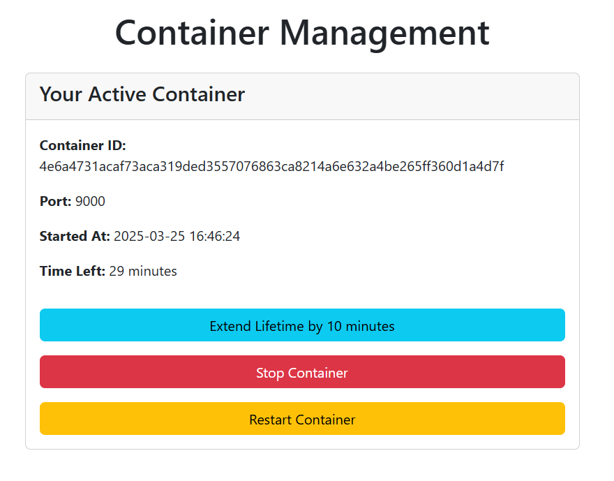
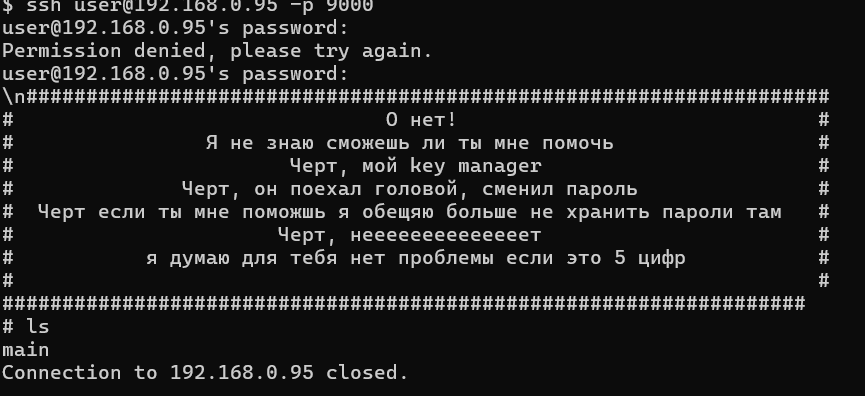
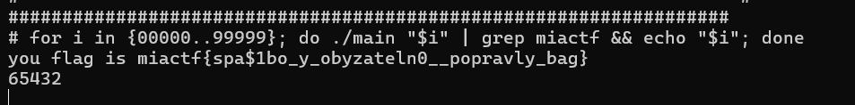

# password_bit | Easy | Admin

## Информация

> Что-то я всё забыл, но помню, что где-то оставил текст задания.  
>
> Per instance deploy: http://<ip>:6664  
>
> SSH: `ssh user@<ip> -p <port>`  
> Пароль: `password`

## Деплой

```sh
cd deploy
docker-compose up --build -d
```

## Выдать участникам

`per instance deploy <ip>:6664`

## Описание

Нужно сбрутить пароль от файла, но терминал работает только в формате one-liner.

## Решение

Поднимаем себе контейнер и подключаемся к нему через SSH:



```bash
ssh user@<ip> -p <port>
```
Пароль: `password`

Пробуем что-то ввести и понимаем, что это one-liner терминал:



Но успеваем заметить, что в системе есть файл `main`. Запускаем его и получаем сообщение:

```
Usage: ./main <pin_code>
```

Программа запрашивает ввод PIN-кода. Нам нужно его подобрать.

Напишем небольшой цикл, который будет перебирать PIN из 5 цифр от `00000` до `99999`. Так как у нас ограничение на выполнение только одной строки, сделаем это в формате one-liner:

```bash
for i in {00000..99999}; do ./main "$i" | grep miactf && echo "$i"; done
```

Через некоторое время брута мы получаем флаг:



## Флаг

`miactf{spa$1bo_y_obyzateln0__popravly_bag}`

