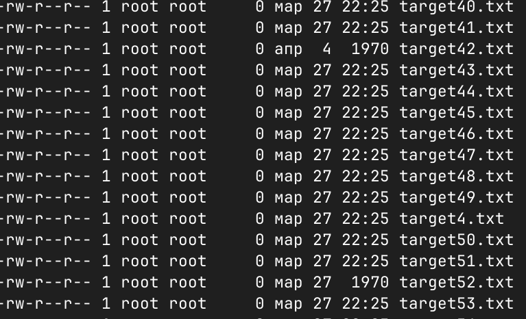
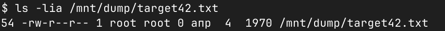
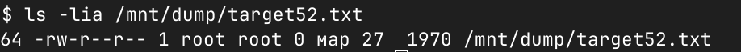
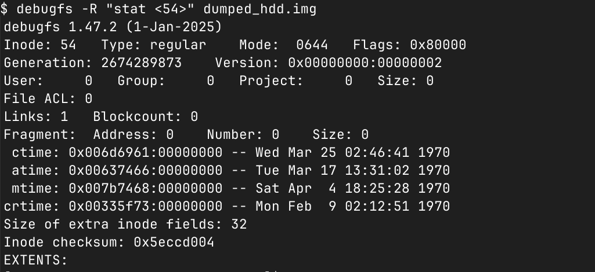
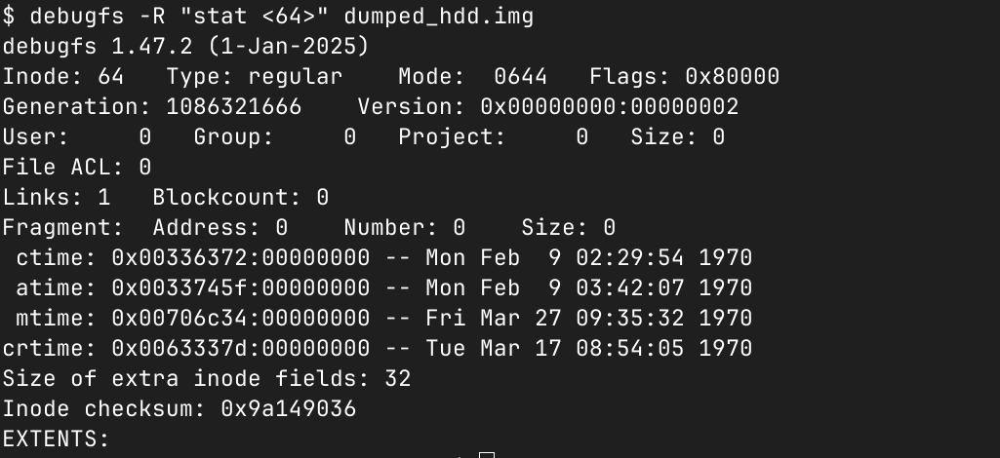
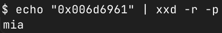

# DumpedHDD | easy | forensic

## Информация

> Когда пришли в офис с проверкой, времени спрятать флаг было не много, поэтому я использовал настолько надёжный метод, что забыл его.. Помоги достать флаг!

## Выдать участинкам

Дамп [dumped_hdd.img](public/dumped_hdd.img) из директории [public/](public/)

## Описание

Участнику необходимо определить "странные" файлы внутри дампа и прочитать их аттрибуты

## Решение

Если примонтировать образ, например `mount dumped_hdd.img /mnt/dump` и просмотреть файлы с помощью команды `ls -l /mnt/dump`, то можно заметить два странных файла, у них время будет отличаться от остальных(`target_42.txt` и `target_52.txt`):

Если посмотреть внутрь, ничего интересного там не будет. Но не зря файлы имеют странную дату - надо посмотреть аттрибуты файла. Для этого надо узнать inode у файла командой `ls -lia /mnt/dump/target42.txt` и `ls -lia /mnt/dump/target52.txt`. Первая цифра и есть inode:

Далее надо прочитать атрибуты (`debugfs -R "stat <54>" dumped_hdd.img` и `debugfs -R "stat <64>" dumped_hdd.img`):

Тут можно заметить, что каждый атрибут времени имеет нестандартное, странное, значение. Надо декодировать ctime 54 inod'ы (`target_42.txt`) с помощью `echo "0x006d6961" | xxd -r -p`: 

Осталось декодировать каждый атрибут времени `echo "0x6d6961 0x637466 0x7b7468 0x335f73 0x336372 0x33745f 0x706c34 0x63337d" | tr -d ' ' | xxd -r -p` и выводом будет флаг.

## Флаг

`miactf{th3_s3cr3t_pl4c3}`

