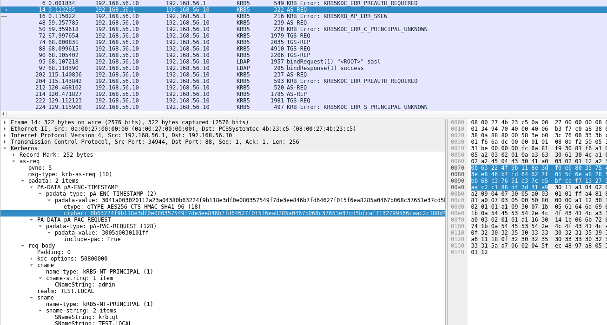
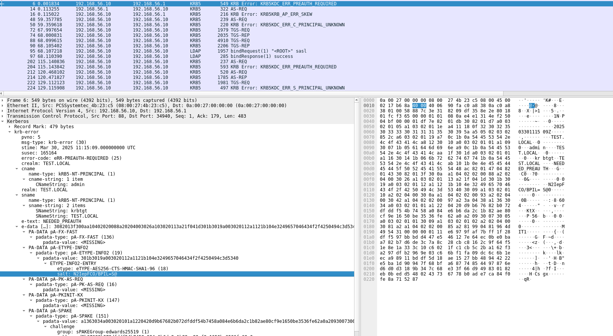
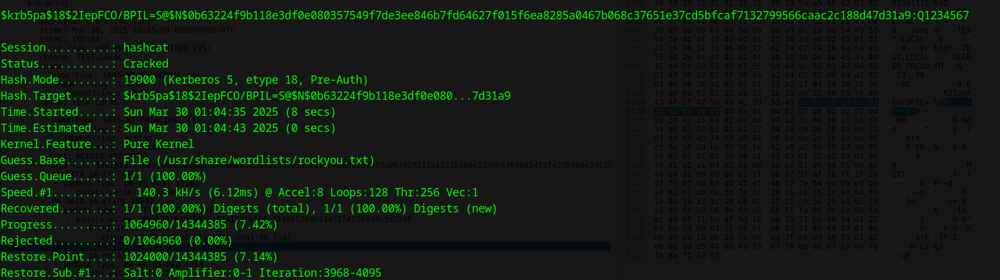
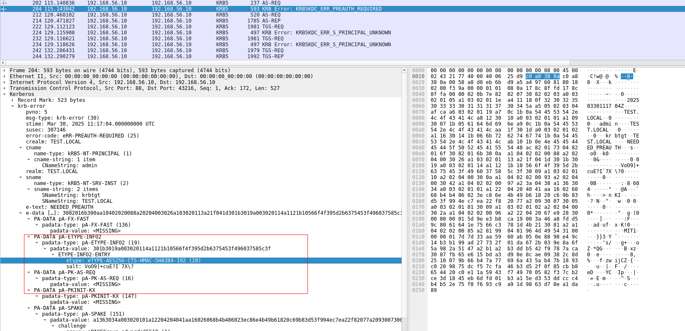
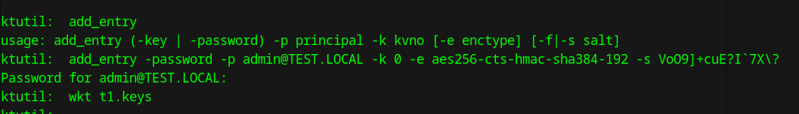
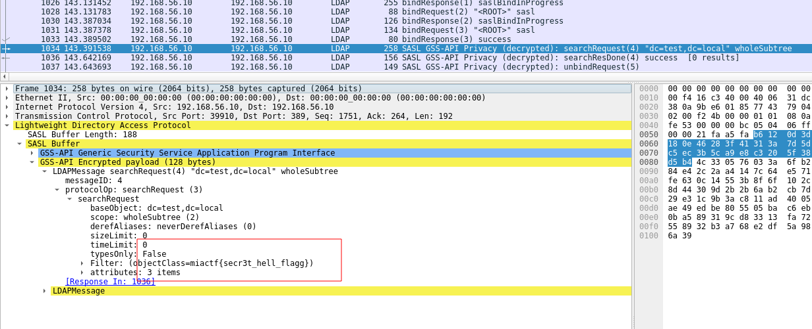

# Музыка из ада | сложный | forensic

## Информация

> Текст, который будет приложен к заданию
>
> Флаг охраняет трёхголовый пёс родом из ада, усыпи его кошкой, если сможешь.
> 

## Выдать участинкам

Архив из директории [public/](public/)

## Описание

Для шифрования ldap в этот раз использовался Kerberos SASL binding так что теперь надо сбрутать по TGS пароль службы, сгенерировать keytab используя катомную соль и расшифровав ldap трафик получить флаг
## Решение

Фильтруем по Kerberos и находим AS-REQ. Достаём метку времени и нестандартную соль пользователя.

Брутим по rockyou.txt из рхива и находим пароль `Q1234567` (`hashcat -a 0 -m 19900 '$krb5pa$18$2IepFCO/BPIL=S@$N$0b63224f9b118e3df0e080357549f7de3ee846b7fd64627f015f6ea8285a0467b068c37651e37cd5bfcaf7132799566caac2c188d47d31a9' /usr/share/wordlists/rockyou.txt`)

Генерируем keytab файл используя нужную соль и etype, и кладём её в wireshark в настройки kerberos и получаем флаг в последнем запросе ldap.

## Флаг

`miactf{secr3t_hell_flagg}`

