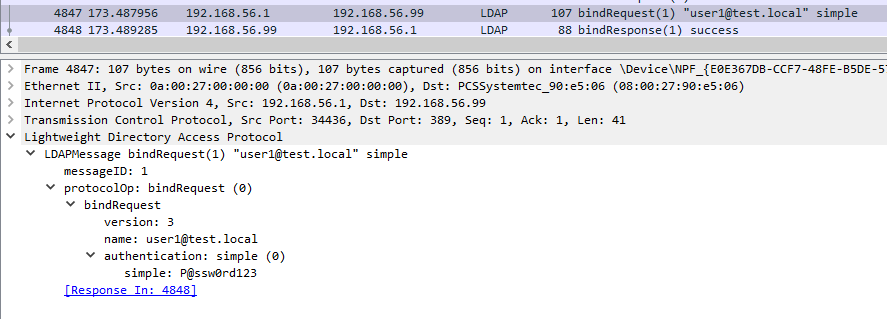
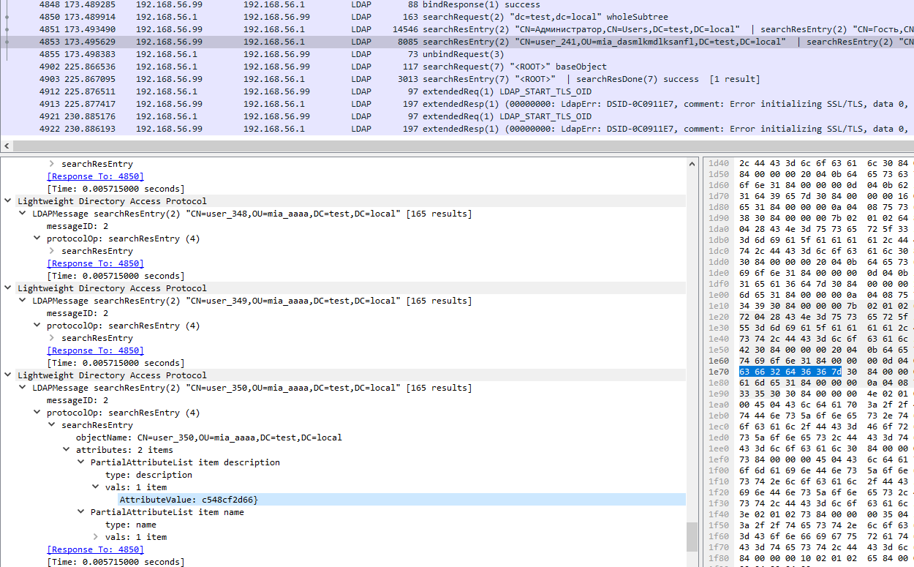
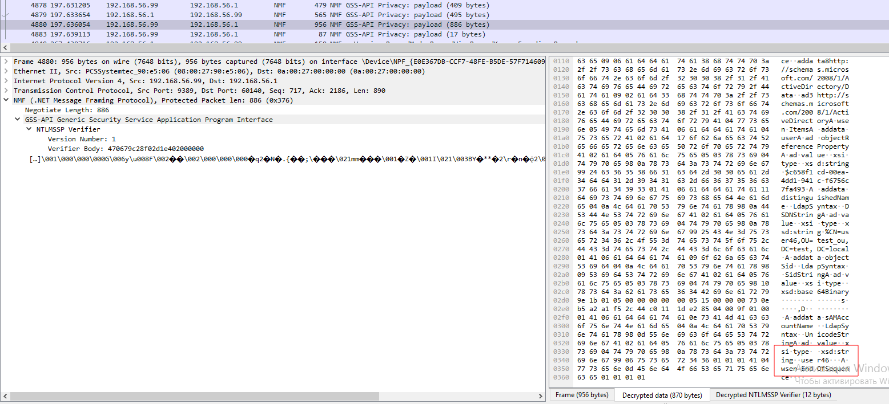
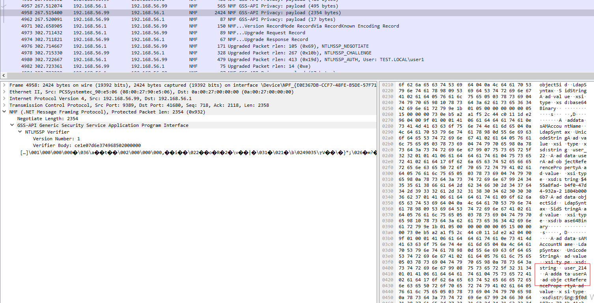
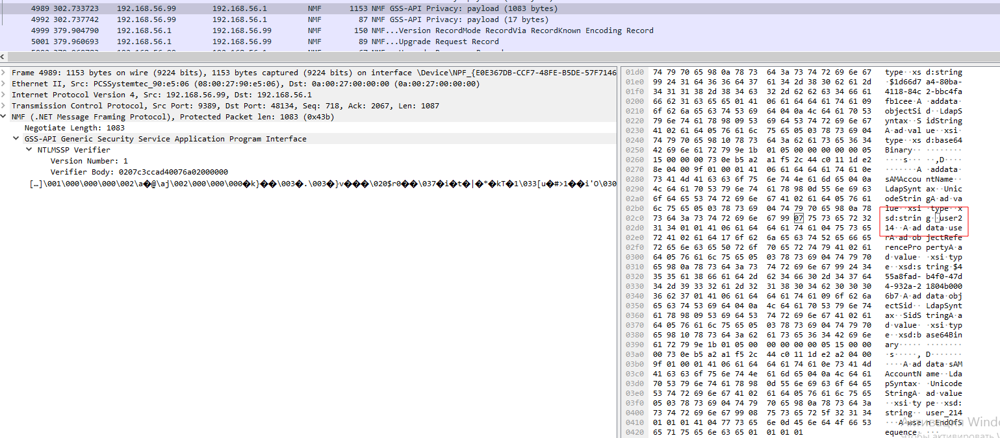
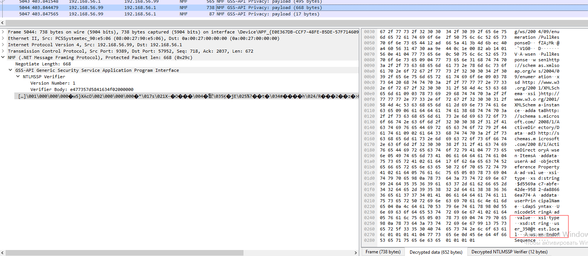

# Мыльная опера | средний | forensic

## Информация

> Текст, который будет приложен к заданию
>
> Какими пользователями интересовался злоумышленник? Соедини description и получи флаг!
> 

## Выдать участинкам

Архив из директории [public/](public/)

## Описание

Надо расшифровать в трафике Soap запросы (NTLMSSP) по паролю, который передавался в LDAP, а потом сопоставить имина пользователей из расшифрованного трафика к их описанию из одного из LDAP запросов. 

## Решение

Фильтруем по LDAP и находим, что был пароль в открытом виде для пользователя user1.

Там же есть список всех пользователей с аттрибутом description.

Фильтруем по nmf и настраиваем NTLMSSP для расшифровки трафика, используя пароль полученный ранее.
Из трафика находим имя первого пользователя.

Потом сопоставляем два следующих запроса и находим общее имя для следующего пользователя.

И в конце находим последнего пользователя.

## Флаг

`miactf{cccf3995b582998339f7c548cf2d66}`

