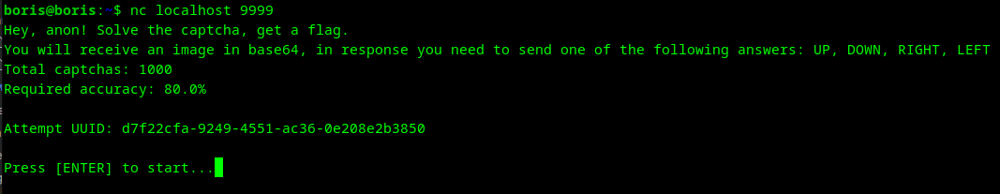
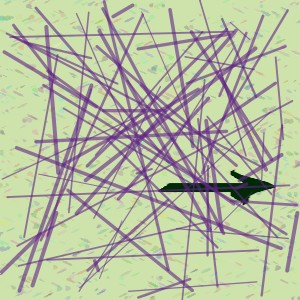

# arrows | hard | ppc

## Информация

> Подключайтесь:  
> nc {ip} 10019

## Деплой

```sh
cd deploy
docker-compose up --build -d
```

## Выдать участинкам

Ничего кроме инфы из раздела "Информация".

## Описание

Нужно решить 1000 каптч с винрейтом в 80%.  
Участники подключаются к сокету, который отдаёт им картинку в base64 и ожидает ответа на каптчу.

## Решение

Подключаемся к сокету с помощью команды из описания таски, либо любым другим способом. 

Видим текст:


Понимаем, что дальше нас ждут картинки в base64. Жмём ENTER, получаем длинную строку, пробуем её раздикодить в картинку
через любой онлайн декодер ([например](https://base64.guru/converter/decode/image)), получаем что-то такое:  


Помним, что в изначальном тексте нас просили отправить один из вариантов ответа: UP, DOWN, RIGHT, LEFT.
Видим на экране стрелку в право, отправляем RIGHT, получаем следующую картинку и видим что значение acc (~~accuracy~~), 
стало равно 100%, т.е. мы ответили верно.

Так как таких капч будет 1000, руками это делать долго и не весело, пишем скрипт, который всё сделает за нас.
[Пример скрипта.](solve/solve.py)

Я использовал подход с [Template Matching](https://docs.opencv.org/4.x/d4/dc6/tutorial_py_template_matching.html), его 
хватает чтобы выбить 80%. Возможно вы решили делать как-то по другому.
## Флаг

`miactf{up_up_down_d0wn_l3ft_right_left_r1ght_s0lved_cap7cha_g3t_th3_fl4g}`

