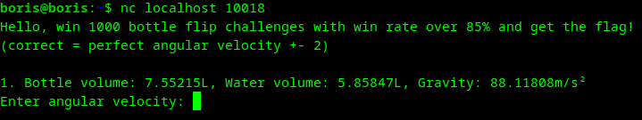
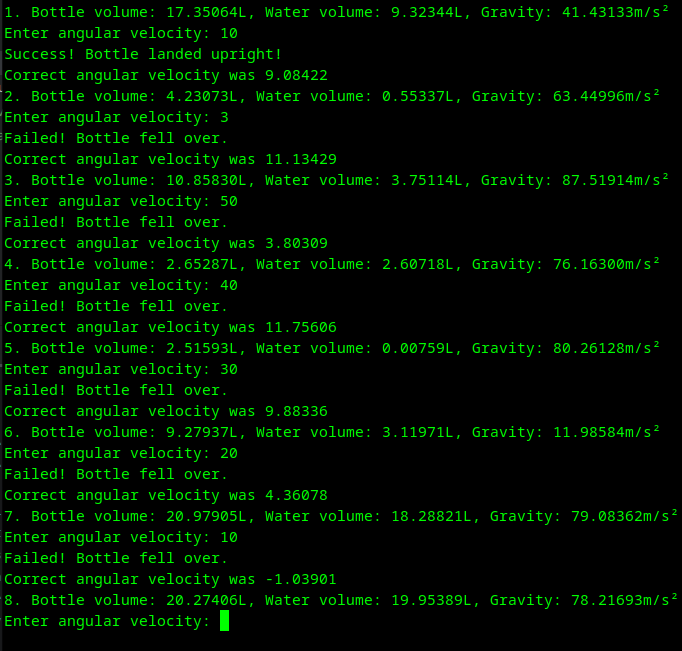
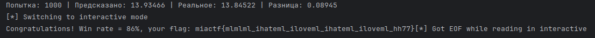

# bottleflip | medium | ppc

## Информация

> Подключайтесь:  
> nc {ip} 10018

## Деплой

```sh
cd deploy
docker-compose up --build -d
```

## Выдать участинкам

Ничего кроме инфы из раздела "Информация".

## Описание

Участникам даётся 3 переменных, нужно предсказать выходное значение не линейной функции, сама функция скрыта.
Нужно предсказать 85% из 1000 значений функции, допустимая погрешность +-2.
Сервис в конце каждой задачи отдаёт верный ответ, таким образом можно собрать датасет и обучить на нём нейросеть, 
которая апроксимирует функцию.

## Решение

Подключаемся к сокету с помощью команды из описания таски, либо любым другим способом. 

Видим текст:


Получаем на вход 3 значения (объем бутылки, объем воды и гравитацию), нужно посчитать 4-е значение (угловую скорость).
~~Задача не имеет ничего общего с физикой.~~

Попробуем ввести разные значения, получим:

Видим что сервис в конце каждрй задачки отдаёт верный ответ.

Дальше можем попробовать сами прикинуть, каким образом эти параметры взаимодействуют и как вычисляется 3-я функция, может у кого-то
получится. А можем собрать датасет входных и выходных значений и обучить на них нейросеть, которая апроксимирует эту функцию, вот и решение.

Решение поделил на 3 скрипта:
1. [Сбор данных](solve/collect_data.py);  
    Cобираем 15000 семплов и примерно делим 80/20 для трейна/теста;
2. [Обучение модели](solve/train.py);  
    Здесь обучем модель. Архитектуру, оптимизатор, параметры обучения можете посмотреть в [bottlesolver.py](solve/bottlesolver.py).
3. [Выполняем челендж](solve/solve.py)  
    Здесь берём уже обученную раннее модель, подключаемся к сервису и с помощью модели предсказываем значение функции.
4. Получаем флаг  
    
## Флаг

`miactf{mlmlml_ihateml_iloveml_ihateml_iloveml_hh77}`

