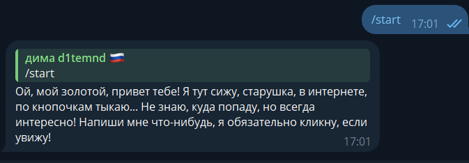
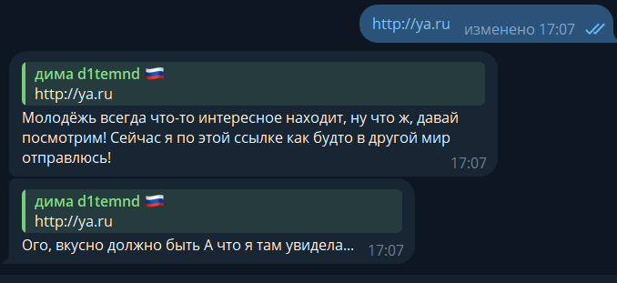
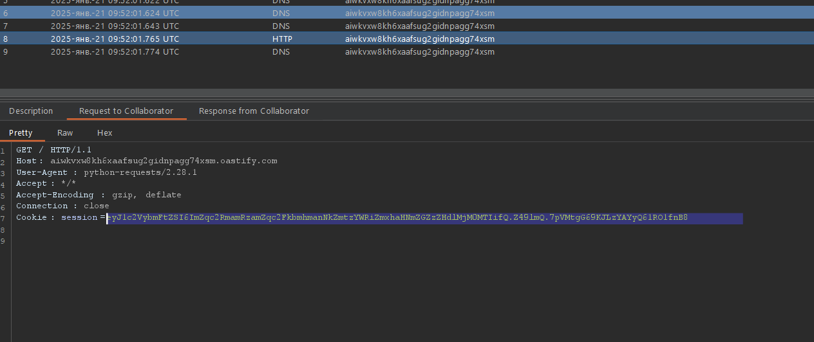
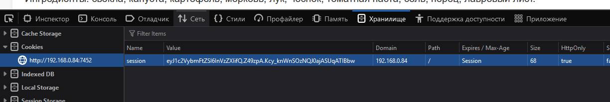
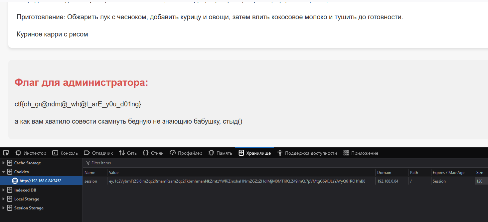

# grandms | medium | web

## Информация

> Привет, я бабушка. Внук у меня хакер и настроил чтото, чтобы я не вводила пароли
> Ну я в этом не разбираюсь 
> 
> http://<ip>:7452
> <user_name бота>

## Деплой
создать бота в телеграмме и указать его токен в [compose](Deploy/docker-compose.yml) 

```sh
cd deploy
docker-compose up --build -d
```

## Выдать участинкам

телеграм чат с ботом и IP:PORT сервера

## Описание

Внук настроил бабушке автоматическую отправку куки.
Задача состоит в том, чтобы вытащить их у бабушки. Она неграмотная, и её не научили, что не нужно переходить по всем ссылкам, так что это будет несложно.

Сначала достаем все заголовки (headers), с которыми она заходит на сайт, включая куки. Затем используем эти куки, подменяя их в своём запросе.

## Решение

Заходим в чат и активируем "электро-бабушку".  
Видим, что она говорит, будто тыкает по кнопкам:  
  

Пробуем закинуть любую ссылку:  
  

Она может не всегда переходить по ним и придумывать отговорки.  

Создаем фишинг-сайт, который будет вытягивать все хедеры из запроса:  
[Эксплоит](solve/solveV2.py)  

Или используем Burp Suite Pro в режиме Collaborator и отправляем ей ссылку:  
  

Видим, что она постоянно передает куки. Копируем их и идем на сайт.  

Обнаруживаем, что нам доступна регистрация. Регистрируемся, чтобы получить собственные куки:  
  

Затем подменяем их на те, которые украли у бабушки:  
  

## Флаг

`miactf{oh_gr@ndm@_wh@t_arE_y0u_d01ng}`

